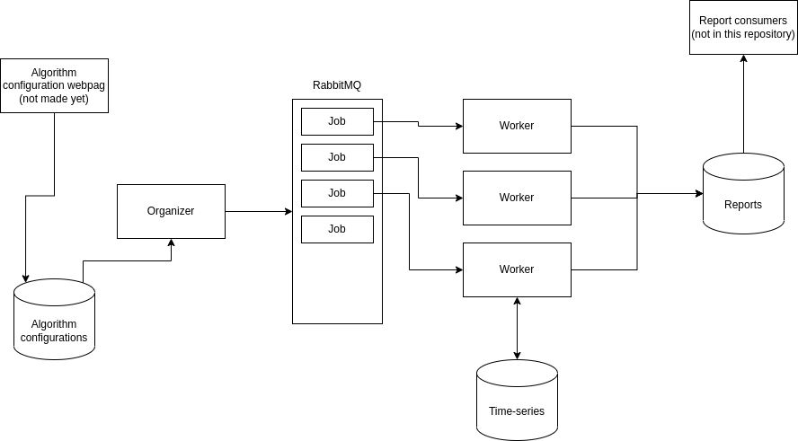

# Repository structure

- mocks: dummy data
- organize: dotnet application reading algorithm configuration and creating jobs which is pushed to rabbit mq queue system
- worker: python application which is running the job created by the organizer. This should read the needed data from the time-series database. Do necessary calculations. Write data back to time-series if needed. Create a report if the user should be noticed about something. Multiple instances should be running.

# Architecture



# Development

Start environment:

```
docker-compose up
```

Open a new vs-code window at `./worker`, open this in development container.
Connect this development container to the docker-compose network (run from outside the container):

```
./connect.sh
```

Start coding.

If encountering permissions error, run: `./worker/vs-fix.sh`, when the container is shut down.
